# Dokumentacja projektu „Notatnik”
**Przedmiot:** Projektowanie Interfejsów Użytkownika II  \
**Autor:** Krystian Chaim\
**Rok akademicki:** 2024/2025\
**Numer indeksu:** 37667

---

## 1. Wstęp

Aplikacja **Notatnik** to prosta, samodzielna w działaniu webowa aplikacja do tworzenia, przeglądania i edycji notatek. Dane użytkownika przechowywane są w przeglądarce w `localStorage`, dzięki czemu nie wymaga ona zaplecza serwerowego. Przy pierwszym uruchomieniu aplikacja ładuje zestaw przykładowych notatek, a następnie pozwala dodawać, modyfikować i usuwać kolejne. Projekt powstał w ramach przedmiotu „Projektowanie Interfejsów Użytkownika II” i składa się z pięciu podstron:
- Strona główna (`index.html`)
- Lista notatek (`notes.html`)
- Widok pojedynczej notatki / edycja wybranej notaktki (`note.html`)
- Kategorie notatek (`categories.html`)
- Kontakt / About (`about.html`)

Główne cele projektu to:
1. Pełna responsywność (mobile, tablet, desktop)
2. Dynamiczne operacje CRUD z użyciem JavaScript i `localStorage`
3. Pobieranie danych z publicznego API JSONPlaceholder
4. Estetyczny, czytelny interfejs z przyklejoną stopką

---

## 2. Opis struktury serwisu
├ krystianchaim.github.io\
├─ index.html\
├─ notes.html\
├─ note.html\
├─ categories.html\
├─ about.html\
├─ css/\
│ └─ style.css\
├─ data/\
│ └─ chrome/\
│ └─ edge/\
│ └─ firefox/\
│ └─ opera/\
└─ js/\
&nbsp; └─ api.css\
&nbsp; └─ script.css\

- **`index.html`** – strona startowa z przyciskiem przenoszącym do listy notatek i krótkim opisem aplikacji.
- **`notes.html`** – główny widok listy notatek: filtr, przyciski „Nowa notatka”, "Przywróć notatki", „Wyczyść wszystkie” i „Pobierz z API”, oraz siatka kafelków z tytułami notatek.
- **`note.html`** – edycja pojedynczej notatki: pola `input` na tytuł, `select` na kategorię, `textarea` na treść oraz przyciski „Zapisz”, „Usuń” i „Wróć”.
- **`categories.html`** – trzy kolumny (Personalne, Praca, Inne), w których wyświetlane są notatki w danej kategorii.
- **`about.html`** – formularz kontaktowy z polami `Imię`, `Email`, `Wiadomość` i przyciskiem „Wyślij”.
- **`data.html`** – folder zawierający zrzuty ekranu przedstawiający testy aplikacji na różnych przeglądarkach.
- **`README.md`** – dokumentacja aplikacji.

Wszystkie podstrony zawierają wspólne elementy: nagłówek z logo i menu (z mobilnym toggle’em), przyklejoną do dołu stopkę, oraz odwołania do `css/style.css` i odpowiednich skryptów JS.

---

## 3. Opis technologii zastosowanych przy tworzeniu serwisu

- **HTML5** – semantyczne tagi, poprawne atrybuty `meta` dla responsywności.
- **CSS3**
    - **Flexbox** i **CSS Grid** do layoutu (responsywne menu, kolumny kategorii, siatka notatek).
    - **Media queries** dla trzech breakpointów:
        - **mobile**: ≤ 767 px
        - **tablet**: 768–1023 px
        - **desktop**: ≥ 1024 px
    - **Sticky footer** uzyskany przez `html, body { height:100% }`, `body { display:flex; flex-direction:column }` i `main { flex:1 }`.
    - Stylizacja formularzy: jednolite `input`, `select`, `textarea` z `border-radius`, `box-shadow` w focus.
- **JavaScript (ES6+)**
    - Modularny kod w dwóch plikach:
        - **`api.js`** – funkcje `loadNotes()`, `saveNotes()`, `addNote()`, `updateNote()`, `deleteNote()`, `getNote()`.
        - **`script.js`** – inicjalizacja stron po `DOMContentLoaded`, routing wg nazwy pliku, obsługa przycisków, fetch z JSONPlaceholder API, zarządzanie flagą pierwszego uruchomienia (`initialized`).
    - **`localStorage`** jako źródło prawdziwych danych – notatki są zapisywane w przeglądarce i odczytywane przy każdym otwarciu aplikacji.
    - **Fetch API** do pobrania przykładowych postów z `https://jsonplaceholder.typicode.com/posts?_limit=10`.
- **Publiczne API**
    - **JSONPlaceholder** – API pozwalające ćwiczyć operacje CRUD na przykładach „postów”.

---

## 4. Testy

Aplikację przetestowano na trzech rozdzielczościach i w czterech przeglądarkach. Zrzuty ekranów umieszczono w odpowiednich dla każdej przeglądarki folderach. Brak natomiast testów dla przeglądarki Safari (nieobsługiwane w Windows).

### 4.1 Rozdzielczości i foldery

| Rozdzielczość | Desktop | Tablet | Mobile |
|---------------|---------|--------|--------|
| Szerokość px  | 1000    | 800    | 600    |

- **chrome/**
    - `chrome/desktop.png`  
      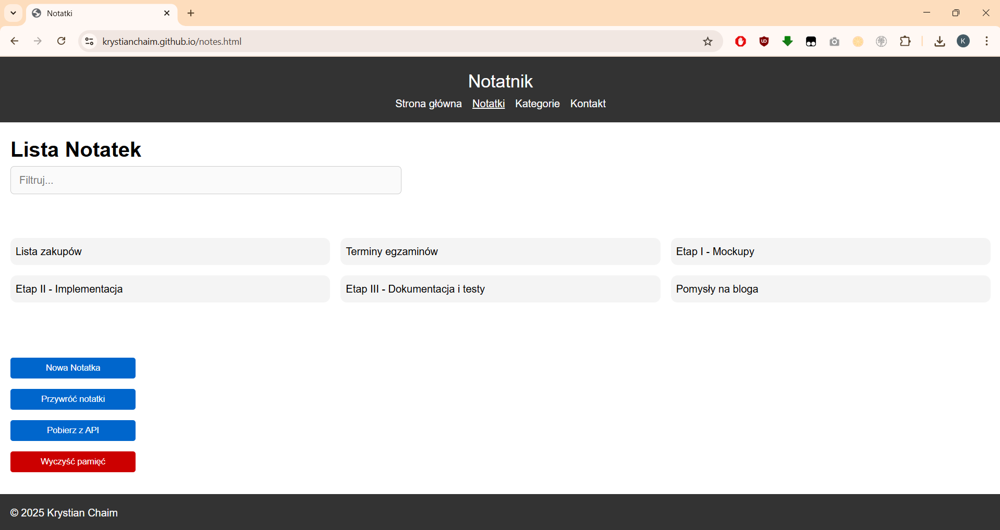
    - `chrome/tablet.png`  
      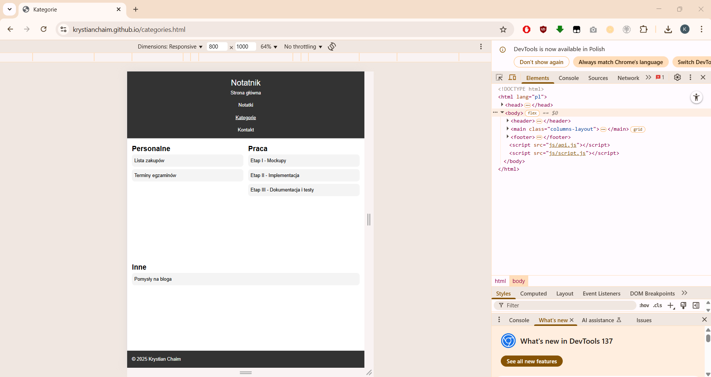
    - `chrome/mobile.png`  
      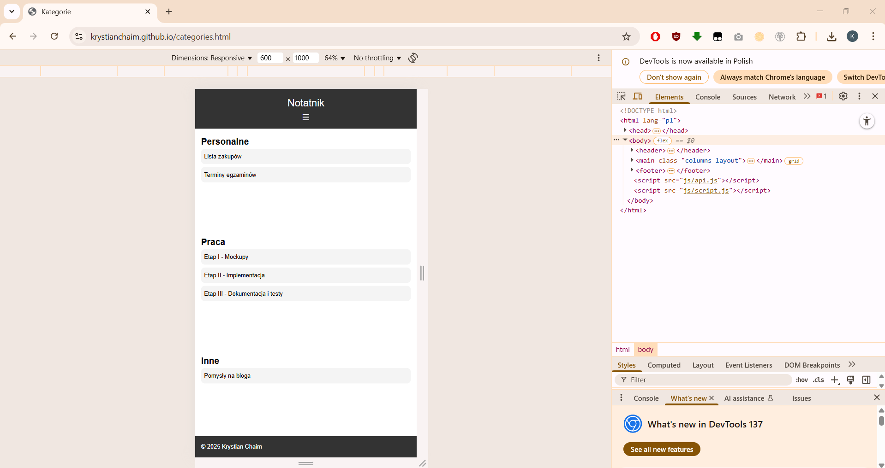

- **edge/**
    - `edge/desktop.png`  
      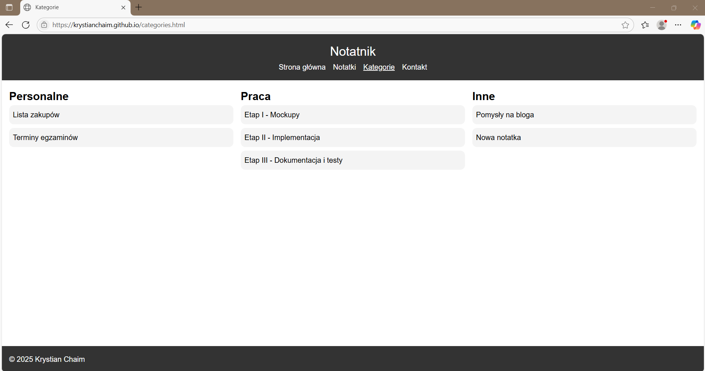
    - `edge/tablet.png`  
      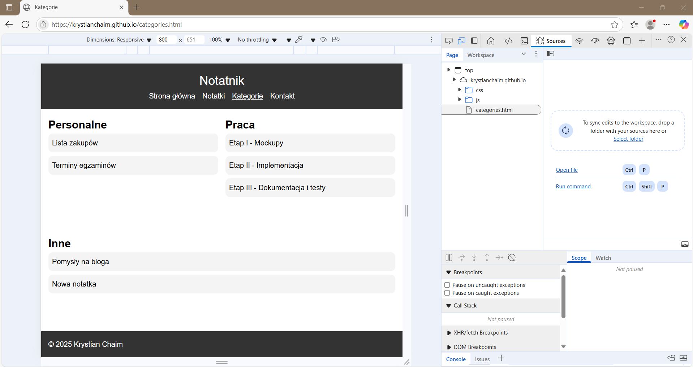
    - `edge/mobile.png`  
      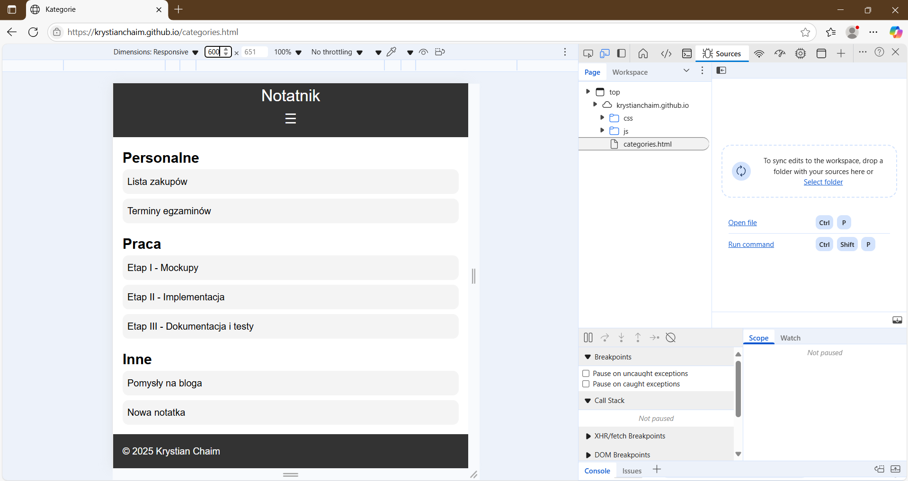

- **firefox/**
    - `firefox/desktop.png`  
      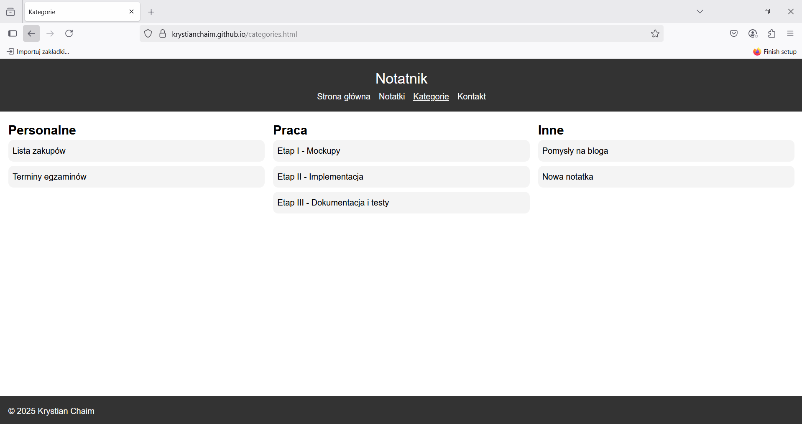
    - `firefox/tablet.png`  
      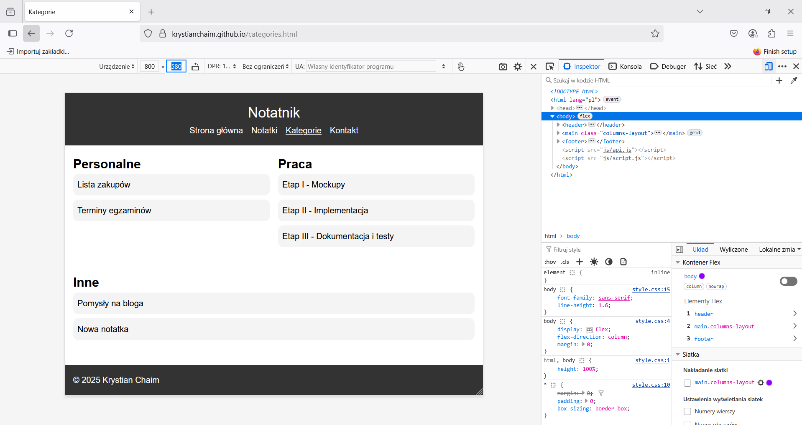
    - `firefox/mobile.png`  
      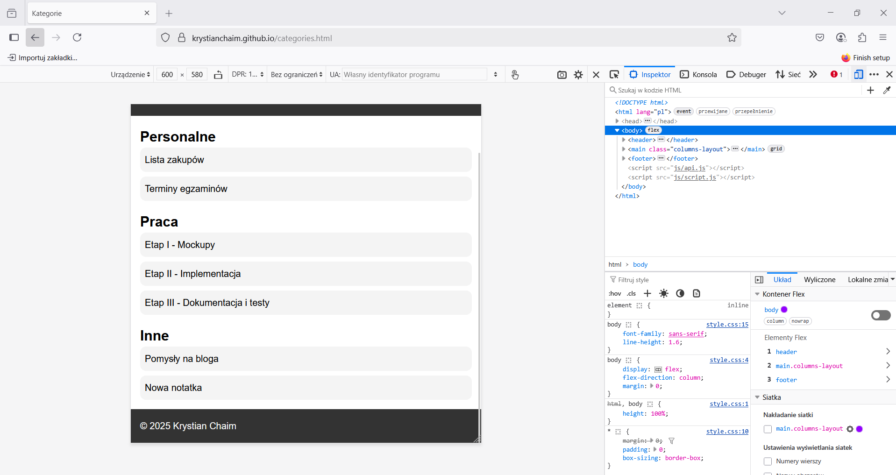

- **opera/**
    - `opera/desktop.png`  
      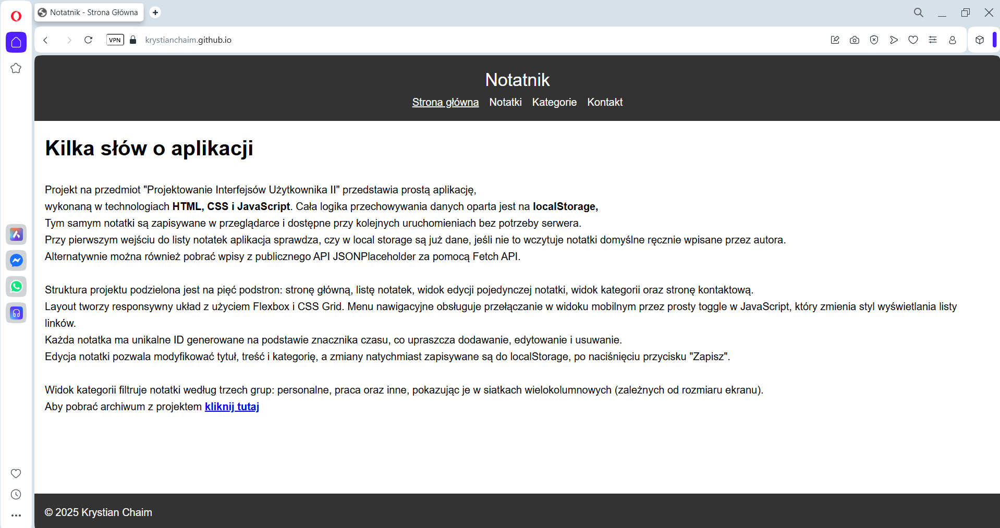
    - `opera/tablet.png`  
      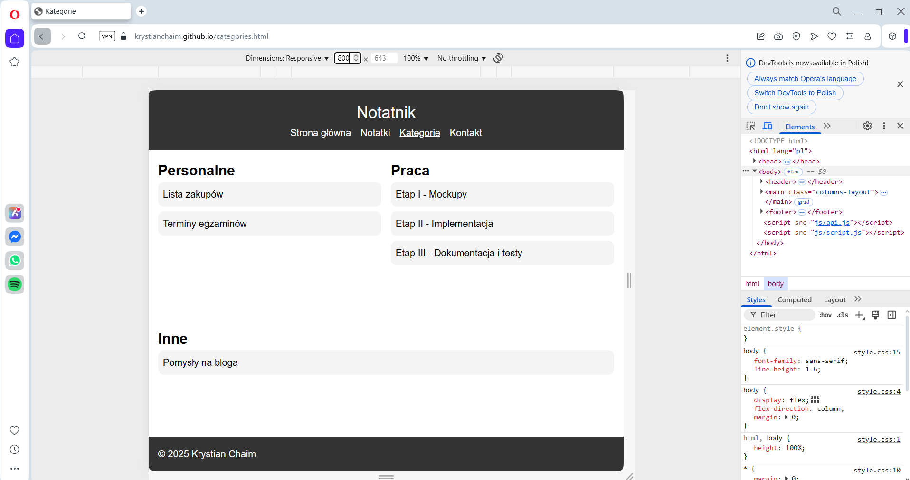
    - `opera/mobile.png`  
      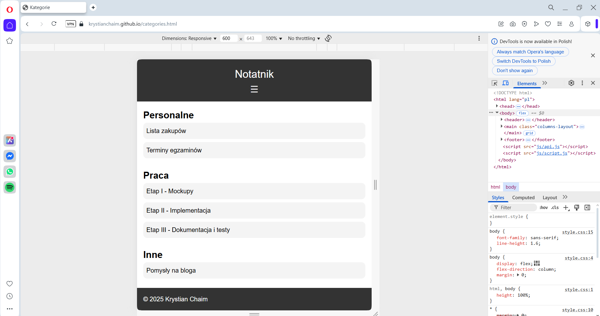

> **Wnioski z testów:**
> - Interfejs poprawnie dostosowuje się do trzech breakpointów we wszystkich przeglądarkach.
> - Menu mobilne działa analogicznie we wszystkich testowanych środowiskach.
> - Formularze (`note.html`, `about.html`) zachowują spójność stylów.
> - Operacje CRUD (dodawanie, edycja, usuwanie, czyszczenie, fetch z API) poprawnie zapisują i odczytują dane z `localStorage`.

---

## 5. Podsumowanie

Projekt **Notatnik** spełnia wszystkie założenia przedmiotu:
- **Responsywność** zmienna w zależności od rozdzielczości (3 poziomy)
- **Minimum pięciu podstron** z jednolitym nagłówkiem, stopką i menu
- **Dynamiczne przetwarzanie danych** w `localStorage` oraz opcjonalny import z zewnętrznego API
- **Dokumentacja** zawierająca wstęp, opis struktury, technologii, testy (ze zrzutami) oraz podsumowanie

Kod projektu jest łatwy do zrozumienia i rozbudowy, co umożliwia w przyszłości dodanie kolejnych funkcji, np. tagowania notatek, synchronizacji z backendem czy udostępniania notatek w chmurze.

---

*Koniec dokumentacji*
